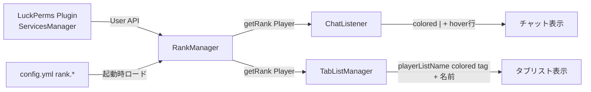

# LuckPermsランク表示 設計

## 概要

LuckPerms(Velocityで運用、権限管理の実体)のグループ所属を読み取り、StellariaCore側で「Booster / Admin(表示名: 管理者) / Mod(表示名: スタッフ)」の3ランクを、チャットとタブリストに視覚的に表示する。VIP等の課金っぽい呼称は使わない。

## 動機・背景

- 権限判定(`hasPermission`)はLuckPermsを入れるだけで既存コードのままでも機能するが、「このプレイヤーは今どのグループか」を取得するAPIは別物で、これまでこのプラグインでは触っていなかった。
- `TabListManager`には既に「名前の色/prefix/suffixの変更は今のところ扱わない（対応する権限グループ等の仕組みがまだ無いため）」というコメントがあり、この機能がまさにその欠けていたピースにあたる。
- チャット・タブリストは既にconfig駆動のテンプレート機構(`ChatListener`/`TabListManager`/`PlaceholderManager`)を持っており、ランク表示もその流儀(config駆動、LuckPermsが無くても壊れない)に揃える。

## スコープ

**含む:**
- チャット: 送信者名の前にランク色の太字`"| "`（ランク無しはグレー`&%7`）
- チャット: 送信者名ホバーツールチップに、ランクがあれば表示名の行を追加
- タブリスト: 名前の前にランクの小型キャップスタグ（例: `ᴀᴅᴍɪɴ`）を色付きで表示（ランク無しはタグ無し）
- LuckPermsが未導入でも例外を出さず、全員「ランク無し」表示にフォールバック

**含まない（YAGNI）:**
- Belowname/Scoreboardへのランク表示（依頼にないので対象外）
- ランクごとの追加権限・特典付与（LuckPerms側で完結する話であり、このプラグインの責務ではない）
- LuckPerms未導入時の代替権限チェック機構（Vaultと同じく「無ければ無効化」のみ）
- グループの動的リロード監視（`/stellariareload`で設定を読み直せば十分。LuckPerms側のグループ変更はプレイヤーの次のtick/発言で自然に反映されるため、イベント購読は行わない）

## アーキテクチャ



`RankManager`が唯一の「LuckPermsを読む場所」になる。`ChatListener`と`TabListManager`はどちらも`RankManager.getRank(player)`を呼ぶだけで、LuckPerms APIを直接扱わない。

## コンポーネント

### 1. `build.gradle.kts` / `plugin.yml`

- `compileOnly("net.luckperms:api:5.4")` を追加（Maven Central、追加リポジトリ不要）。
- `plugin.yml` の `softdepend` に `LuckPerms` を追加（`depend`にはしない。無くても他機能は普通に動く）。

### 2. `config.yml` — `rank.*`

```yaml
rank:
  enabled: true
  default:
    color: "&%7"
  groups:
    - luckperms-group: "admin"
      color: "&%e"
      tablist-tag: "ᴀᴅᴍɪɴ"
      display-name: "管理者"
    - luckperms-group: "mod"
      color: "&%b"
      tablist-tag: "sᴛᴀꜰꜰ"
      display-name: "スタッフ"
    - luckperms-group: "booster"
      color: "&%d"
      tablist-tag: "ʙᴏᴏsᴛᴇʀ"
      display-name: "ブースター"
```

- リストの並び順＝優先度（複数グループに所属していたら先に書かれた方を採用）。
- `luckperms-group` はLuckPerms側の実グループ名。表示名・色・タグはconfig側で自由に変更できるので、実グループ名が変わってもコード変更は不要。

### 3. `RankManager`（新規、`managers/`）

```java
public record RankInfo(String color, String tablistTag, String displayName) {}

public class RankManager {
    // onEnable で Bukkit.getServicesManager().load(LuckPerms.class) を試みる
    // 取れなければ warning ログを出し、以後 getRank は常にデフォルトを返す

    public RankInfo getRank(Player player) { ... }
    public boolean isEnabled() { ... } // LuckPermsが有効かつrank.enabled=trueか
    public void reload() { ... } // /stellariareload から config.yml の rank.* を読み直す
}
```

- `getRank`: LuckPerms `UserManager` から `User` を取得（`loadUser` はI/Oを伴うため、オンラインプレイヤーには `luckPerms.getUserManager().getUser(uuid)`（キャッシュ済み前提、オンライン中は必ずロード済み）を使い、追加のブロッキング呼び出しをしない）。`user.getInheritedGroups(user.getQueryOptions())` で所属グループ名の集合を取り、config の `groups` リストを順に見て最初に一致したものを返す。どれとも一致しなければ `default` を返す。

### 4. `ChatListener` 変更

- `render()` に渡す `nameComponent` の直前に、`RankManager.getRank(sender)` の色で太字`"| "`を連結する（`ColorUtil.component(rankInfo.color() + "&l| ")`）。
- `buildTooltip()`: ランクがあれば `"&%7ランク: " + color + displayName` の行を既存の `chat.tooltip.lines` の前に追加する。

### 5. `TabListManager` 変更

- `tick()`のループ内、各 `target` について `RankManager.getRank(target)` を引き、タグがあれば `<color><tag> </color>` + 元の表示名を `Component` として組み立て、`target.playerListName(component)` を呼ぶ。タグが無ければ `target.playerListName(null)`（プレイヤー本来の名前に戻す＝Bukkitのデフォルト表示）。

## データフロー

1. `onEnable`: `RankManager` 生成 → LuckPerms取得 → config読み込み。
2. チャット送信時: `ChatListener.onChat` → `rankManager.getRank(sender)` → 色付き `"| "` をレンダリングに合成。
3. タブリストtick（既存の `tablist.update-interval-ticks` 間隔）: `TabListManager.tick()` の中で全オンラインプレイヤー分 `rankManager.getRank(target)` を引いて `playerListName` を更新。
4. `/stellariareload`: `ConfigManager.reload()` の後、`RankManager.reload()` で `rank.*` を読み直す（`StellariaCore#reloadFeatureManagers()` に1行追加）。

## エラーハンドリング

- LuckPerms未導入: `onEnable`で警告ログ1行、`RankManager.getRank`は常に`default`を返す（例外を投げない）。
- `rank.enabled: false`: `getRank`は常に`default`を返す（LuckPerms自体は取得を試みない）。
- オンラインプレイヤーの`User`がLuckPerms側で未ロード（通常起こらないはずだが念のため）: `null`なら`default`を返す。
- config の `groups` に不正なエントリ（`luckperms-group`欠落等）があればログ警告してそのエントリだけスキップ。

## テスト・検証方針

このリポジトリに自動テストは無い（CLAUDE.md記載の通り）ため、`./gradlew compileJava` でのビルド確認に加え、`./gradlew runServer` でLuckPermsを導入したローカルサーバーに実際に3グループを設定して目視確認する:

- 各グループ所属プレイヤーでチャット送信 → 名前前の`"| "`色とホバー内のランク表示名を確認
- タブリストでタグ・色を確認
- LuckPermsを外した状態でも起動・チャット・タブリストが例外なく動くことを確認（デフォルト表示になること）
- `/stellariareload` 実行後、config変更（色・タグ）が反映されることを確認
